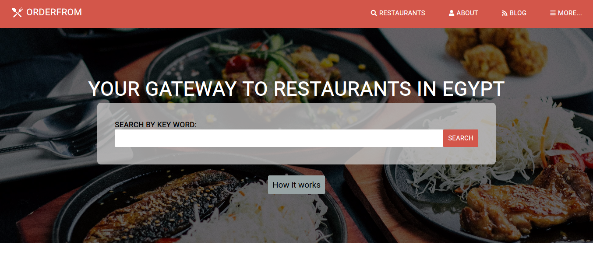

# HTML-CSS3-Capstone-Project

### This project built with pure HTML and CSS3. It was fully responsive for all devices. The idea is to order food from restaurants near the user. The project has three pages ( home page, search page and details page ).

## Built With

- Html
- Css3
- Fontawesome
- Built with CSS responsive techniques as "Flex, Grid and, Media queries".

## Usage

1- Open your terminal.
2- Paste "git clone https://github.com/ammarkandel/HTML-CSS-Capstone-Project.git" in the terminal.
3- cd HTML-CSS-Capstone-Project
4- Open index.html
5- Congratulations, you are here now!

## Live Demo

[Live Demo Link](https://ammarkandel.github.io/HTML-CSS-Capstone-Project/)

👤 **Ammar El refay Kandel**

- GitHub: [ammarkandel](https://github.com/ammarkandel)
- Twitter: [@AmmarQandel](https://twitter.com/AmmarQandel)
- LinkedIn: [LinkedIn](https://www.linkedin.com/in/ammar-kandel-7b4100193/)

#### Contributions, issues and feature requests are welcome! Start by:

- Push your branch up to your forked repository
- Open a Pull Request with a detailed description to the development branch of the original project for a review

## Show your support

Give a ⭐️ if you like this project!

## Acknowledgments

- Design author credits: Mathew Njuguna | PatashuleKE | Behance designer.
